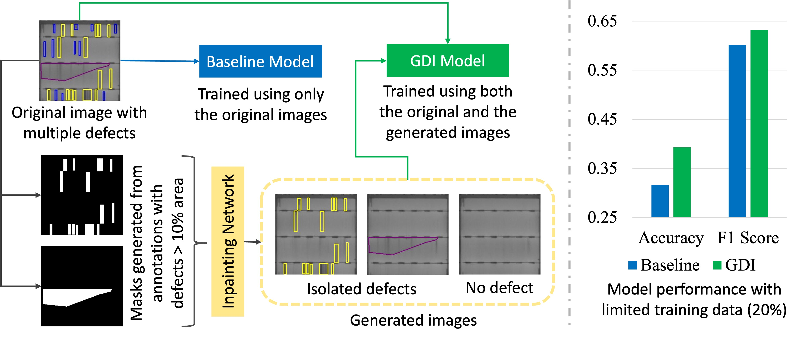
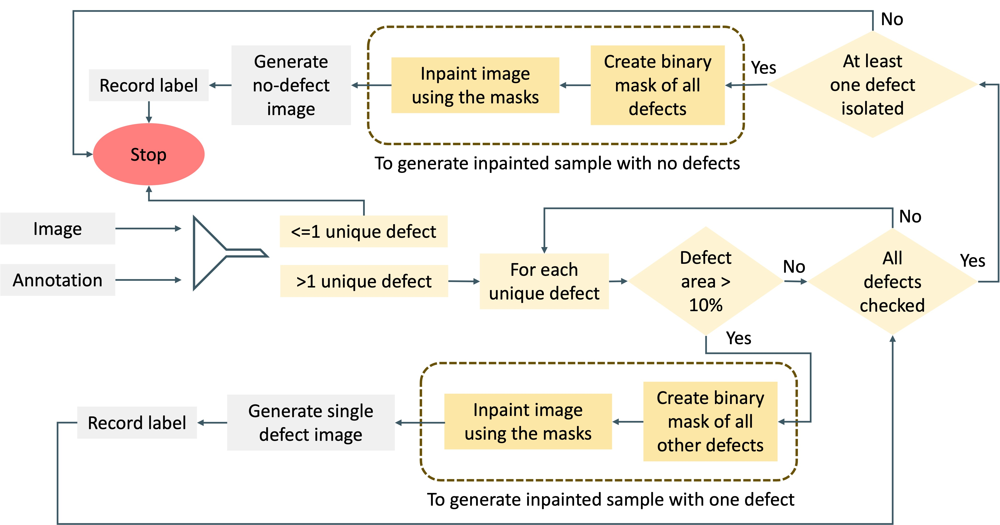
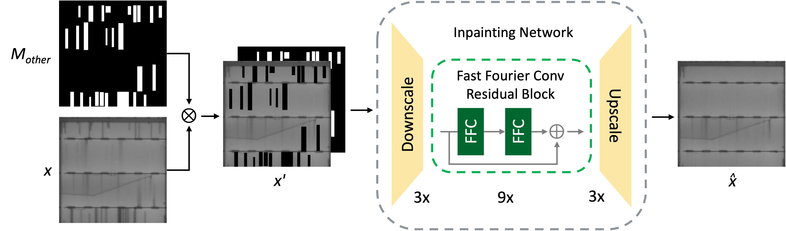

# Generative Defect Isolation (GDI)

<p align="center">
  
</p>

This repository accompanies the paper:

> **A Generative Approach for Improving Multi-Label Defect Classification in Photovoltaic Modules**  
> A. Mueez, Y. S. Rawat, S. Vyas — **Solar Energy** (2026)  
> [ScienceDirect](https://www.sciencedirect.com/science/article/pii/S0038092X26006328) · [DOI](https://doi.org/10.1016/j.solener.2026.114943)

### Data and reproducibility

To support both **exact reproducibility** and **broader research reuse**, we provide two complementary data resources. The exact experiment split preserves the train/test setup used in the paper, while the generated-data release makes GDI outputs from both train and test source partitions available as a standalone resource for future work on synthetic-data augmentation, defect classification and photovoltaic EL analysis.

- **Exact data used in the paper:** [Google Drive — train/test split](https://drive.google.com/drive/folders/1Grwl55IqPvrFaZK4f7tlIi9u8ymuQO53?usp=sharing)  
  The training split contains the original training images together with GDI-generated images; the test split contains **original images only**.
- **Generated-data release:** [UCF-EL-GDI on Hugging Face](https://huggingface.co/datasets/mueez-overflow/UCF-EL-GDI/)  
  This release contains GDI-generated images derived from source images in **both the train and test partitions used in this work**.
- **Original dataset:** [ucf-photovoltaics/UCF-EL-Defect](https://github.com/ucf-photovoltaics/UCF-EL-Defect)

Generative Defect Isolation (GDI) is an annotation-guided augmentation method for electroluminescence (EL) images of photovoltaic (PV) cells. Starting from a real image containing multiple co-occurring defects, GDI uses pixel-level defect annotations and **LaMa inpainting** to remove selected defects. This produces samples containing an isolated target defect while preserving the visual context of the original PV cell. GDI can also remove all annotated defects to generate a `No_Defect` sample.


## Paper overview

Multi-label defect classification is difficult because multiple PV defects can occur in the same EL image. Co-occurring defects can make it harder for a classifier to associate specific visual features with individual labels, especially for rare classes.

The paper repurposes the segmentation annotations in UCF-EL-Defect for data augmentation. Rather than synthesizing complete EL images from noise, GDI selectively removes annotated defects from real images using neural inpainting. The resulting training data combine the original multi-defect images with generated samples containing simplified defect compositions.

The method was evaluated with **ViT-S**, **ViT-L** and **EfficientNetV2-L** using **1%, 5%, 10%, 20%, 50% and 100%** training-data settings.

## Results

<p align="center">
  
</p>

**Performance comparison of baseline and GDI models across the 1%, 5%, 10%, 20%, 50% and 100% training splits.** The top row shows Zero-One Accuracy and the bottom row shows Macro F1 Score.

GDI generally improves both metrics, with the largest relative gains appearing in data-scarce settings. Results reported in the paper include:

- **ViT-S:** +125.1% relative Zero-One Accuracy improvement at the 10% split and +20.3% Macro F1 improvement at the 1% split.
- **ViT-L:** +129.0% relative Zero-One Accuracy improvement at the 5% split and +9.8% Macro F1 improvement at the 1% split.
- **EfficientNetV2-L:** the strongest full-data result, reaching **0.6046 Zero-One Accuracy** and **0.7744 Macro F1** with GDI.
- Co-occurring error pairs decreased from **1,774 to 1,312**, a **26% reduction**.

### Multi-seed robustness study

The 20% experiment was repeated using seeds **24, 42, 67 and 76** and evaluated at a fixed decision threshold of `0.5`.

| Architecture | Method | Accuracy (mean ± std) | Macro F1 (mean ± std) |
|---|---|---:|---:|
| EfficientNetV2-L | Baseline | 0.3439 ± 0.0072 | 0.5743 ± 0.0168 |
| EfficientNetV2-L | **GDI** | **0.3872 ± 0.0318** | **0.6006 ± 0.0057** |
| ViT-S | Baseline | 0.3467 ± 0.0123 | 0.5710 ± 0.0057 |
| ViT-S | **GDI** | **0.3883 ± 0.0111** | **0.5965 ± 0.0119** |
| ViT-L | Baseline | 0.3083 ± 0.0196 | 0.5430 ± 0.0199 |
| ViT-L | **GDI** | **0.3379 ± 0.0217** | **0.5572 ± 0.0140** |

Across the 12 paired architecture/seed comparisons, GDI improved Zero-One Accuracy in **11/12** runs and Macro F1 in **10/12** runs.

The multi-seed experiment code used for the robustness study is available in [`experiments/multiseed/`](experiments/multiseed/).

## GDI example

<p align="center">
  
</p>

The source image above contains four annotated defect classes. Only `Contact_NearSolderPad` and `Crack_Resistive` exceed the configured area threshold, so isolated samples are generated for those classes together with a `No_Defect` image.

## GDI workflow

<p align="center">
  
</p>

For each source image containing **more than one unique defect type**, GDI:

1. computes the annotated area occupied by each defect class;
2. checks each unique defect against the configured area threshold;
3. for an eligible target defect, creates a binary mask covering all annotated defects **except** the target;
4. dilates the mask to provide a buffer around annotation boundaries;
5. inpaints the masked regions with LaMa, leaving the target defect in its original context;
6. repeats the process for every eligible target defect; and
7. if at least one defect was isolated, creates a combined mask of all defects and inpaints it to produce one `No_Defect` sample.

### LaMa inpainting

<p align="center">
  
</p>

The paper uses LaMa because its Fast Fourier Convolution components are well suited to reconstructing long-range and periodic structures such as PV-cell grid lines and busbars.

## GDI parameters

The two main preprocessing parameters are configurable.

| Parameter | CLI argument | Setting used in the paper | Description |
|---|---|---:|---|
| Defect area threshold | `--area-threshold` | **10%** | A target defect is isolated only when its annotated area is **strictly greater than** this percentage of the image. |
| Mask dilation kernel | `--dilate-kernel-size` | **15** | Side length of the square dilation kernel applied before inpainting. The paper used **15 × 15**. |

The defaults match the paper:

```bash
--area-threshold 10 \
--dilate-kernel-size 15
```

Both can be changed, for example:

```bash
python generate_gdi.py \
  ... \
  --area-threshold 5 \
  --dilate-kernel-size 21
```

## Data releases and experimental split

The paper experiments use an **80:20 training/test split**.

For the published experiments:

- GDI-generated samples are added to the **training** data;
- the **test** data remain original and unaugmented;
- images with zero or one unique defect type are not processed for defect isolation;
- a target defect is generated only when its annotated area exceeds the configured threshold;
- a `No_Defect` image is produced only when at least one isolated-defect sample was generated from that source.


The two releases are complementary: the exact experimental split is intended for reproducing the published results, while the standalone generated-data release makes synthetic GDI outputs from both train and test source partitions available for broader research use. When reproducing the paper, generated images derived from the test partition should **not** be added to the training set.

## Requirements

### UCF-EL-Defect

Download the original UCF-EL-Defect dataset and its VGG Image Annotator (VIA) annotations:

https://github.com/ucf-photovoltaics/UCF-EL-Defect

The generator expects a VIA annotation CSV containing at least:

| Column | Description |
|---|---|
| `filename` | Source image filename |
| `region_shape_attributes` | VIA JSON describing the annotation geometry |
| `region_attributes` | VIA JSON containing `Defect_Class` |

Supported annotation geometries are `rect`, `polygon`, `circle` and `ellipse`.

### Inpaint-Anything / LaMa

The GDI generator uses the **LaMa inpainting integration** provided by [Inpaint-Anything](https://github.com/geekyutao/Inpaint-Anything).

Use the upstream **`main` branch**, since the current GDI generator expects the `lama_inpaint.py` module and LaMa directory structure provided there:

```bash
git clone --branch main https://github.com/geekyutao/Inpaint-Anything.git
```

GDI constructs its masks directly from the UCF-EL-Defect annotations, so a SAM checkpoint is **not required** for this pipeline. Only the LaMa inpainting components are used.

Install the LaMa dependencies from the Inpaint-Anything repository:

```bash
cd Inpaint-Anything
python -m pip install torch torchvision torchaudio
python -m pip install -r lama/requirements.txt
cd ..
```

The two LaMa paths used by `generate_gdi.py` come from different places:

- **LaMa configuration:** `lama/configs/prediction/default.yaml` is included when you clone the Inpaint-Anything repository.
- **LaMa checkpoint:** `pretrained_models/big-lama` is **not included in the Git clone**. Download the `big-lama` checkpoint using the links in the [Inpaint-Anything README](https://github.com/geekyutao/Inpaint-Anything#-remove-anything) and place it under `Inpaint-Anything/pretrained_models/big-lama/`.

After downloading the checkpoint, a convenient directory layout is:

```text
workspace/
├── Inpaint-Anything/
│   ├── lama/
│   │   └── configs/
│   │       └── prediction/
│   │           └── default.yaml
│   ├── lama_inpaint.py
│   └── pretrained_models/
│       └── big-lama/
│           ├── config.yaml
│           └── models/
├── generative-defect-isolation/
└── UCF-EL-Defect/
    ├── AnnotationsCombined.csv
    └── <source-image-directory>/
```

Install the dependencies for this repository:

```bash
cd generative-defect-isolation
pip install -r requirements.txt
```

## Generate GDI samples

```bash
python generate_gdi.py \
  --csv-file ../UCF-EL-Defect/AnnotationsCombined.csv \
  --img-dir ../UCF-EL-Defect/<source-image-directory> \
  --inpaint-anything-dir ../Inpaint-Anything \
  --lama-config ../Inpaint-Anything/lama/configs/prediction/default.yaml \
  --lama-ckpt ../Inpaint-Anything/pretrained_models/big-lama \
  --output-dir ./generated_gdi \
  --area-threshold 10 \
  --dilate-kernel-size 15 \
  --device cuda
```

If CUDA is unavailable, use `--device cpu`, or omit `--device` to allow automatic device selection.

An editable example is provided in [`examples/run_gdi.sh`](examples/run_gdi.sh).

### Visualizations

To save source-level GDI visualizations, add:

```bash
--visualizations-dir ./gdi_visualizations
```

The script creates one composite visualization per multi-defect source image.

The first row contains:

1. the original EL image;
2. the original image with all annotated defects highlighted in class-specific colors; and
3. a legend showing each class, its annotated area percentage and its threshold status.

Subsequent rows contain **only generated samples**. Each eligible isolated-defect class gets a row with the generated image, the generated image with the preserved defect highlighted and the class name. `No_Defect` is shown once because there is no remaining defect to highlight.

Only visualization copies are resized. The generated GDI images themselves retain their native resolution.

The visualization boundary thickness is controlled by:

```python
VIZ_BOUNDARY_THICKNESS = 1
```

This affects visualization outlines only, not the masks used for inpainting.

## Output

By default, generated data are written to `generated_gdi/`:

```text
generated_gdi/
├── Contact_BeltMarks/
├── Contact_Corrosion/
├── Contact_FrontGridInterruption/
├── Contact_NearSolderPad/
├── Crack_Closed/
├── Crack_Isolated/
├── Crack_Resistive/
├── Interconnect_BrightSpot/
├── Interconnect_Disconnected/
├── Interconnect_HighlyResistive/
├── No_Defect/
├── Unknown/
├── inpainted_single_label_images.csv
├── gdi_manifest.csv
├── defect_areas.csv
└── generation_stats.json
```

- `inpainted_single_label_images.csv` contains one-hot labels for the generated images.
- `gdi_manifest.csv` stores source-image provenance and generation type.
- `defect_areas.csv` stores pre-dilation annotated area percentages.
- `generation_stats.json` stores run parameters and generation statistics.

## Citation

If you use **GDI**, the generated synthetic data, or any part of this work, please cite:

```bibtex
@article{mueez2026gdi,
  title={A Generative Approach for Improving Multi-Label Defect Classification in Photovoltaic Modules},
  author={Mueez, Abdul and Rawat, Yogesh S. and Vyas, Shruti},
  journal={Solar Energy},
  year={2026},
  doi={10.1016/j.solener.2026.114943}
}
```