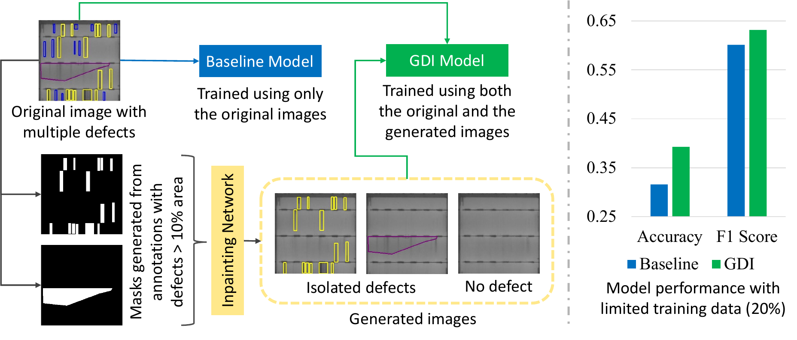
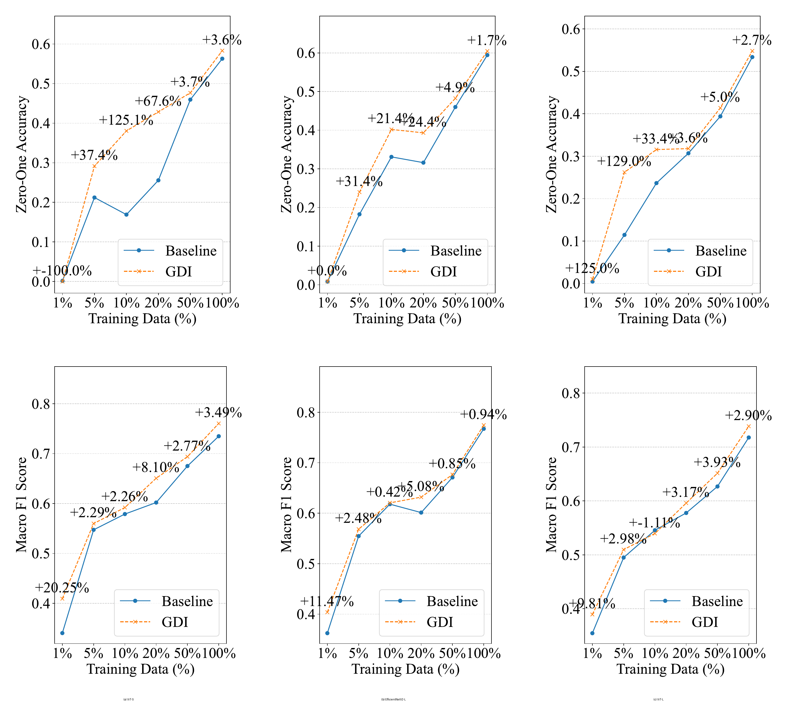
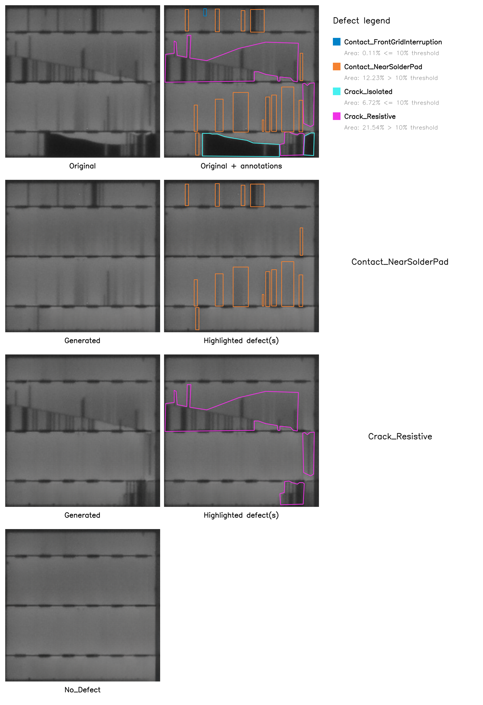

# Generative Defect Isolation (GDI)

<p align="left">
  
</p>

This repository accompanies the paper:

> **A Generative Approach for Improving Multi-Label Defect Classification in Photovoltaic Modules**  
> A. Mueez, Y. S. Rawat, S. Vyas — *Solar Energy* (2026)  
> [ScienceDirect article](https://www.sciencedirect.com/science/article/pii/S0038092X26006328) · [DOI](https://doi.org/10.1016/j.solener.2026.114943)

**Generated dataset:** [UCF-EL-GDI on Hugging Face](https://huggingface.co/datasets/mueez-overflow/UCF-EL-GDI/)

Generative Defect Isolation (GDI) is an annotation-guided augmentation method for electroluminescence (EL) images of photovoltaic (PV) cells. Starting from a real image containing multiple co-occurring defects, GDI uses pixel-level defect annotations and **LaMa inpainting** to remove selected defects. This creates new samples containing an isolated defect while preserving the real visual context of the original PV cell. GDI can also remove all annotated defects from a source image to generate a `No_Defect` sample.

The Hugging Face release contains GDI-generated images produced from the **full UCF-EL-Defect dataset**, including source images belonging to both the training and test partitions. This broader release is provided to make the generated data available for reuse and further analysis. For the experiments reported in the paper, however, GDI was applied **only to the training split**; the test split remained original and unaugmented.

## Paper overview

Multi-label defect classification is challenging because multiple PV defects can appear in the same EL image. When defect types co-occur, the visual features associated with individual labels can become difficult for a model to disentangle, particularly for rare classes with few training examples.

The paper uses the publicly available **UCF-EL-Defect** dataset, which provides pixel-level segmentation annotations for PV-cell defects. GDI repurposes these annotations for data augmentation: rather than synthesizing an entire image from scratch, it selectively removes annotated defects from a real image using neural inpainting.

The resulting augmented training dataset contains both the original multi-defect images and generated samples with simplified defect compositions. The method was evaluated with **ViT-S**, **ViT-L**, and **EfficientNetV2-L** over training subsets containing **1%, 5%, 10%, 20%, 50%, and 100%** of the available training data.

## Results

<p align="left">
  
</p>

**Performance comparison of the baseline and GDI models across three architectures for the six different training splits: 1%, 5%, 10%, 20%, 50%, 100%.** The top image in each column shows Zero-One Accuracy and the bottom image shows Macro F1 Score.

Across the experiments, GDI generally improved both Zero-One Accuracy and Macro F1, with the largest relative gains occurring in data-scarce settings. Examples reported in the paper include:

- **ViT-S:** +125.1% relative improvement in Zero-One Accuracy at the 10% training-data split and +20.3% in Macro F1 at the 1% split.
- **ViT-L:** +129.0% relative improvement in Zero-One Accuracy at the 5% split and +9.8% in Macro F1 at the 1% split.
- **EfficientNetV2-L:** the strongest full-data result, reaching **0.6046 Zero-One Accuracy** and **0.7744 Macro F1** with GDI.
- Across the error co-occurrence analysis, the total number of co-occurring error pairs decreased from **1,774 to 1,312**, corresponding to a **26% reduction**.

The overall trend shows that GDI is particularly useful when training data are limited, while still providing gains in higher-data settings.

## GDI examples

<p align="left">
  
</p>

**Visual example of the Generative Defect Isolation (GDI) pipeline.** The source image has four defects, but only two of them (`Contact_NearSolderPad` and `Crack_Resistive`) exceed the preset area threshold. GDI therefore generates isolated samples for those two classes together with a defect-free image.

## GDI workflow

For each source image containing **more than one unique defect type**, GDI performs the following steps:

1. Compute the annotated area occupied by each defect class.
2. Select a target defect for isolation when its total annotated area is above the configured area threshold.
3. Create a binary mask covering all annotated defects **except** the target defect.
4. Dilate the mask to provide a buffer around defect boundaries.
5. Inpaint the masked regions with LaMa, producing a sample in which the target defect remains while the other annotated defects are removed.
6. Repeat the process for each eligible target defect in the source image.
7. In this implementation, if the source image produced at least one isolated-defect sample, create a combined mask containing **all** annotated defects and inpaint it to generate one `No_Defect` sample.
8. Save the generated images together with their labels and provenance information.

The paper uses LaMa because its Fast Fourier Convolution components are well suited to reconstructing long-range and periodic structures such as PV-cell grid lines and busbars.

<p align="left">
  
</p>

## GDI parameters

The two main GDI preprocessing parameters are configurable in this implementation.

| Parameter | CLI argument | Setting used in the paper | Description |
|---|---|---:|---|
| Defect area threshold | `--area-threshold` | **10%** | A target defect is isolated only when its annotated area is **strictly greater than** this percentage of the image. |
| Mask dilation kernel | `--dilate-kernel-size` | **15** | Side length of the square dilation kernel applied to the inpainting mask. The paper used **15 × 15**. |

The defaults match the settings reported in the paper:

```bash
--area-threshold 10 \
--dilate-kernel-size 15
```

Both values can be changed. For example:

```bash
python generate_gdi.py \
  ... \
  --area-threshold 5 \
  --dilate-kernel-size 21
```

This would isolate target defects covering more than 5% of the image and use a 21 × 21 dilation kernel.

## Dataset preparation

For the experiments reported in the paper, the original UCF-EL-Defect source images were first partitioned into an **80:20 training/test split**. GDI was then applied **only to the training set**, while the test set remained composed entirely of original, unaugmented images.

Within GDI:

- images containing zero or one unique defect type are not processed for defect isolation;
- a target defect is isolated only when its annotated area exceeds the configured threshold;
- classes at or below the threshold are not generated as isolated samples; and
- in this repository implementation, a `No_Defect` image is generated only when the source image produced at least one eligible isolated-defect sample. If every class in a multi-defect source is at or below the threshold, the source produces no synthetic image.

The published paper describes generating `No_Defect` after the defect-isolation loop for multi-defect images, but it does not explicitly discuss the edge case in which **none** of the defect classes pass the area threshold. The conditional rule above makes that edge case explicit in this implementation.

Using the paper's training split and settings, the paper reports **3,924 additional training samples**, including **1,752 `No_Defect` samples**.

### Public full-dataset release

The [UCF-EL-GDI Hugging Face dataset](https://huggingface.co/datasets/mueez-overflow/UCF-EL-GDI/) contains generated images produced from the **full original dataset**, including source images from both the training and test partitions.

This release is intentionally broader than the augmentation set used in the paper so that the generated images are available as a reusable research resource.

## Requirements

### UCF-EL-Defect

Download the original UCF-EL-Defect dataset and its VGG Image Annotator (VIA) annotations:

https://github.com/ucf-photovoltaics/UCF-EL-Defect

The generator expects a VIA annotation CSV containing at least the following columns:

| Column | Description |
|---|---|
| `filename` | Source image filename |
| `region_shape_attributes` | VIA JSON describing the annotation geometry |
| `region_attributes` | VIA JSON containing `Defect_Class` |

Supported annotation geometries are `rect`, `polygon`, `circle`, and `ellipse`.

### Inpaint-Anything / LaMa

The paper uses the LaMa implementation provided by **Inpaint-Anything**:

https://github.com/geekyutao/Inpaint-Anything

Clone Inpaint-Anything, follow its installation instructions, and download the `big-lama` checkpoint.

A convenient directory layout is:

```text
workspace/
├── Inpaint-Anything/
│   ├── lama/
│   └── pretrained_models/
│       └── big-lama/
├── generative-defect-isolation/
└── UCF-EL-Defect/
    ├── AnnotationsCombined.csv
    └── <source-image-directory>/
```

Install the dependencies used directly by the GDI generator:

```bash
cd generative-defect-isolation
pip install -r requirements.txt
```

## Generate GDI samples

Run:

```bash
python generate_gdi.py \
  --csv-file ../UCF-EL-Defect/AnnotationsCombined.csv \
  --img-dir ../UCF-EL-Defect/<source-image-directory> \
  --inpaint-anything-dir ../Inpaint-Anything \
  --lama-config ../Inpaint-Anything/lama/configs/prediction/default.yaml \
  --lama-ckpt ../Inpaint-Anything/pretrained_models/big-lama \
  --output-dir ./generated_gdi \
  --area-threshold 10 \
  --dilate-kernel-size 15 \
  --device cuda
```

If CUDA is unavailable, use `--device cpu`, or omit `--device` to allow automatic device selection.

An editable example is provided in [`examples/run_gdi.sh`](examples/run_gdi.sh).

### Visualizations

To save GDI visualizations, add:

```bash
--visualizations-dir ./gdi_visualizations
```

The script creates **one composite visualization per multi-defect source image**.

The **first row** contains three panels:

1. the original EL image;
2. the original image with **all annotated defects highlighted in different class-specific colors**; and
3. a legend mapping those colors to the defect classes present in the source image.

The legend also reports the **annotated area percentage for every defect class** and whether that class is above or at/below the configured generation threshold.

From the **second row onward, the visualization contains only images that were actually generated by GDI**. Each eligible isolated-defect class gets one row containing:

1. the generated isolated-defect image;
2. the same generated image with the preserved defect region(s) highlighted; and
3. the defect class name.

If several annotated regions belong to the preserved class, all of those regions are highlighted. The highlight color is the same color used for that class in the first-row legend.

A `No_Defect` row is added only if at least one isolated-defect class was generated from that source. It contains only the generated `No_Defect` image because there is nothing left to highlight.

Only visualization copies are resized. The generated GDI images saved under the output directory retain their native resolution.

The visualization directory is flat, with one summary image per processed source:

```text
gdi_visualizations/
├── <source-image-1>_gdi_summary.png
├── <source-image-2>_gdi_summary.png
└── ...
```

## Output

By default, generated data are written to `generated_gdi/`:

```text
generated_gdi/
├── Contact_BeltMarks/
├── Contact_Corrosion/
├── Contact_FrontGridInterruption/
├── Contact_NearSolderPad/
├── Crack_Closed/
├── Crack_Isolated/
├── Crack_Resistive/
├── Interconnect_BrightSpot/
├── Interconnect_Disconnected/
├── Interconnect_HighlyResistive/
├── No_Defect/
├── Unknown/
├── inpainted_single_label_images.csv
├── gdi_manifest.csv
├── defect_areas.csv
└── generation_stats.json
```

### `inpainted_single_label_images.csv`

Contains one-hot labels for every generated image. The `filename` field stores the image path relative to the output directory.

### `gdi_manifest.csv`

Stores the provenance of every generated sample.

| Column | Meaning |
|---|---|
| `filename` | Generated image path relative to the output directory |
| `source_filename` | Original EL image |
| `label` | Label assigned to the generated image |
| `generation_type` | `isolated_defect` or `all_defects_removed` |
| `target_area_percent` | Preserved target area for isolated-defect images |
| `source_unique_defects` | Number of unique annotated defect types in the source image |

### `defect_areas.csv`

Stores each annotated class's percentage area for the multi-defect source images processed by GDI. Areas are calculated **before mask dilation**.

### `generation_stats.json`

Stores a machine-readable summary of the completed run, including:

- the area threshold and dilation kernel used;
- the number of source images with zero, one, or multiple unique defects;
- the number of target defects that passed or failed the area threshold;
- the number of isolated-defect and `No_Defect` images generated;
- isolated-defect generation counts by class;
- the number of source-level composite visualizations and total visualization panels, when enabled; and
- total runtime and average runtime per processed multi-defect source image.

The same statistics are printed to the terminal at the end of the run.


## Links

- **Generated dataset:** [UCF-EL-GDI on Hugging Face](https://huggingface.co/datasets/mueez-overflow/UCF-EL-GDI/)
- **Paper:** [ScienceDirect](https://www.sciencedirect.com/science/article/pii/S0038092X26006328) · [DOI](https://doi.org/10.1016/j.solener.2026.114943)
- **Original dataset:** [ucf-photovoltaics/UCF-EL-Defect](https://github.com/ucf-photovoltaics/UCF-EL-Defect)
- **Inpaint-Anything:** [geekyutao/Inpaint-Anything](https://github.com/geekyutao/Inpaint-Anything)

## Citation

If you use **GDI (Generative Defect Isolation)**, the generated synthetic data, or any part of this work, please cite:

```bibtex
@article{mueez2026gdi,
  title={A Generative Approach for Improving Multi-Label Defect Classification in Photovoltaic Modules},
  author={Mueez, Abdul and Rawat, Yogesh S. and Vyas, Shruti},
  journal={Solar Energy},
  year={2026},
  doi={10.1016/j.solener.2026.114943}
}
```
